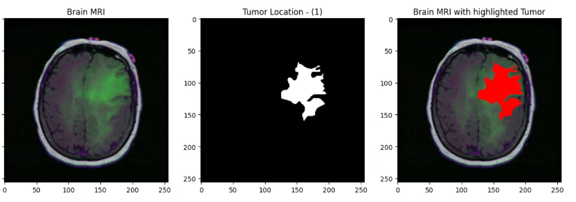
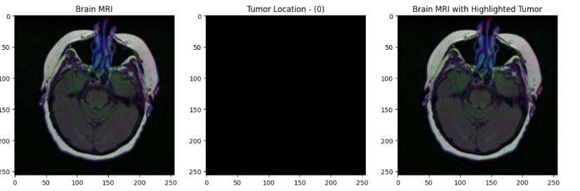
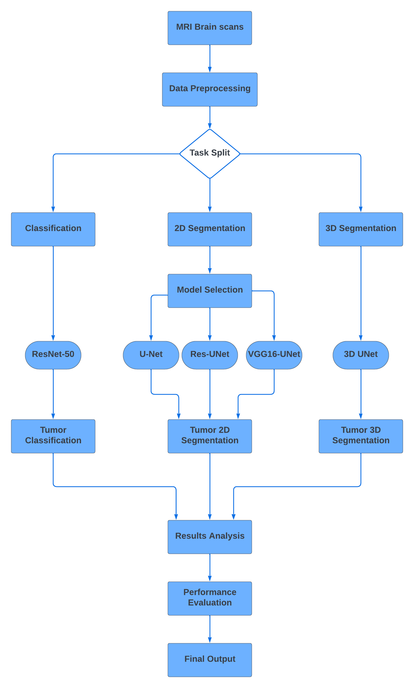
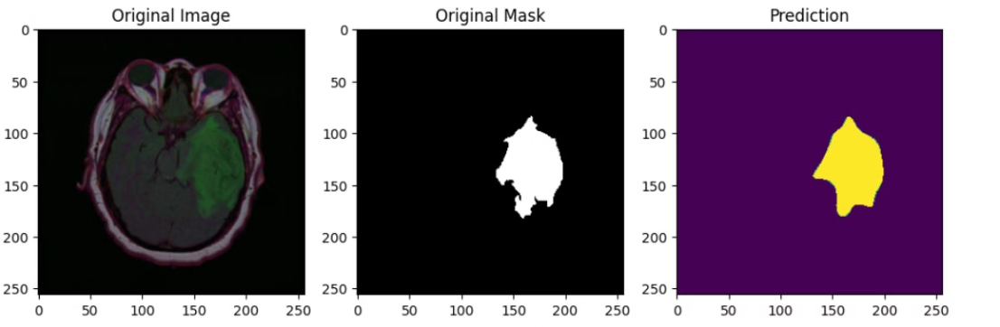
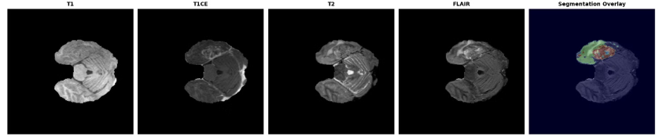
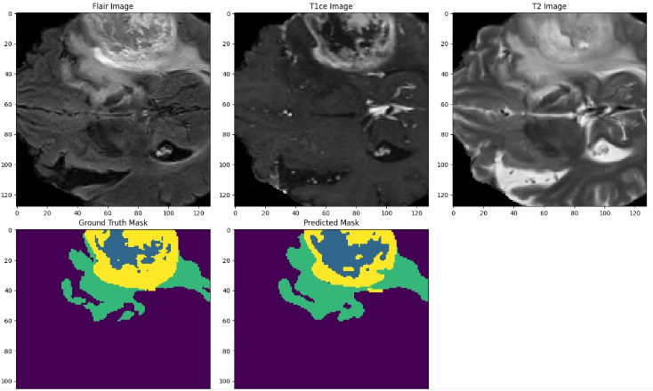

# 🧠 3D MRI Brain Tumor Segmentation

A deep learning–based framework for **automated brain tumor classification and segmentation** from MRI scans, leveraging both **2D** and **3D** architectures.

Developed as the **Graduation Project (GP)** of the **Digital Egypt Pioneers Initiative (DEPI)**  
under the supervision of **Eng. Mahmoud Talaat**  
by **Rehab Hamdy**, **Marina Safwat**, and **Alaa Mohsen**.


---

## 📑 Table of Contents
1. [Introduction](#introduction)
2. [Problem Statement](#problem-statement)
3. [Dataset](#dataset)
4. [Proposed Methodology](#proposed-methodology)
5. [Models Used](#models-used)
6. [Results](#results)
7. [3D Segmentation Extension](#3d-segmentation-extension)
8. [Conclusion](#conclusion)
9. [Future Work](#future-work)
10. [Demo Video](#demo-video)

---

## 🧩 Introduction
Brain tumors are among the most serious medical conditions, requiring **early detection and precise localization**.  
Manual segmentation of MRI scans is **slow**, **subjective**, and **error-prone**.  

To address this, we designed a **deep learning pipeline** capable of:
- Detecting whether a tumor is present (classification).
- Segmenting tumor regions automatically (segmentation).

This study integrates:
- **ResNet-50** for classification.
- **U-Net**, **ResUNet**, and **VGG16-UNet** for 2D segmentation.
- A **3D-U-Net** architecture for full volumetric segmentation.



----



---

## ⚙️ Problem Statement
Manual segmentation requires expert radiologists, is time-consuming, and introduces inconsistency.  
Accurate, automated segmentation is essential for faster and more reliable diagnosis.

| Issue | Description |
|--------|-------------|
| **Manual Process** | Requires expert knowledge and is error-prone. |
| **Tumor Variability** | Tumor shapes, sizes, and contrasts vary widely. |
| **Automation Need** | Deep learning enables consistent and efficient analysis. |

---

## 📊 Dataset

### 2D Dataset 
> 🧠 **Dataset Source:**  
> [MRI Brain Tumor Dataset (Kaggle)](https://www.kaggle.com/datasets/mateuszbuda/lgg-mri-segmentation)

- **Total images:** 4,000 MRI scans.
- **Annotation:** Tumor regions manually labeled.
- **Classes:**  
  - Tumor Present → 1,373  
  - No Tumor → 2,556  
- **Preprocessing:** Normalization, binarization, and augmentation (rotations, flips).

### 3D Dataset (BraTS 2020)
> 🧠 **Dataset Source:**  
> [BraTS 2020 Dataset (Kaggle)](https://www.kaggle.com/datasets/awsaf49/brats20-dataset-training-validation/data)

- Each patient has **4 modalities**:
  - `T1` – anatomical structure  
  - `T1CE` – contrast-enhanced regions  
  - `T2` – fluid regions  
  - `FLAIR` – abnormal fluid accumulation  
- Annotated sub-regions:
  - **ET:** Enhancing Tumor  
  - **TC:** Tumor Core  
  - **WT:** Whole Tumor  

---

## 🧪 Proposed Methodology

### Pipeline Overview
1. **Data Preprocessing** – normalization, binarization, augmentation.  
2. **Model Training** – classification via ResNet-50; segmentation via U-Net, ResUNet, VGG16-UNet.  
3. **Loss Functions** – Dice Loss (segmentation), Cross-Entropy (classification).  
4. **Evaluation Metrics** – Accuracy, Dice Score, IoU, Confusion Matrix.  



---

## 🧱 Models Used

| Model | Type | Task | Key Features |
|--------|------|------|---------------|
| **ResNet-50** | CNN | Classification | Residual blocks; avoids vanishing gradients |
| **U-Net** | Encoder–Decoder | Segmentation | Strong spatial preservation |
| **ResUNet** | Hybrid | Segmentation | Adds residual connections for higher Dice Score |
| **VGG16-UNet** | Deep CNN | Segmentation | Deeper feature extraction, slight underperformance vs ResUNet |


---

## 📈 Results

| Model | Train Acc | Test Acc | Test IoU | Test Dice Score |
|--------|-----------|----------|-----|-------------|
| **U-Net** | 99.83 % | 99.79 % | 78.80 % | 88.05 % |
| **ResUNet** | 99.83 % | 99.81 % | 88.01 % | 88.78 % |
| **VGG16-UNet** | 99.79 % | 99.79 % | 77.53 % | 87.91 % |

**Classification (ResNet-50)** → 95.5 % accuracy.  
**Best 2D Model** → ResUNet.





---

## 🧩 3D Segmentation 

### Motivation
While 2D models process slices independently, **3D U-Net** analyzes the **entire brain volume**, capturing spatial continuity for better localization.

### Dataset & Training
- **Dataset:** BraTS 2020  
- **Training cases:** 371 | **Validation cases:** 127  
- **Modalities merged** as input channels.  
- **Architecture:** 3D convolutions, pooling, and up-sampling with skip connections.

### Results
| Metric | Training | Validation |
|--------|-----------|-------------|
| **Accuracy** | 0.9886 | 0.9808 |
| **IoU** | 0.7742 | 0.6636 |




---

### Predictions
Our **3D U-Net** model successfully segments tumor regions in volumetric MRI data, identifying:
- **Enhancing Tumor (ET):** Actively growing areas highlighted by contrast.  
- **Tumor Core (TC):** Necrotic and non-enhancing central regions.  
- **Whole Tumor (WT):** Combined affected area within the brain volume.

Below are examples comparing predicted vs. ground truth segmentations for different cases.



---

## 🧾 Conclusion
- **ResUNet** achieved the highest performance among 2D models.  
- **3D U-Net** provided volumetric insight and improved clinical interpretability.  
- Automated segmentation greatly reduces time and human variability, supporting radiologists in treatment planning.

---

## 🚀 Future Work
- Scale to **larger multi-center datasets** for robustness.  
- Explore **distributed training** and **model compression** to reduce compute cost.  
- Integrate **post-segmentation analytics** (tumor growth prediction, survival analysis).

---
## 🌐 Website Development for Real-World Use

We have built a **complete website for doctors and patients**, translating our AI research into a real, usable medical tool.

**🧩 NeuroVision Platform**
- **NeuroVision** is a medical web platform designed for comprehensive brain tumor management.
- **Doctors** can upload and analyze MRI scans with **automatic tumor segmentation**, streamlining diagnosis and reporting.
- **Patients** can track their entire medical journey via a **timeline** that stores scan histories, doctor notes, and progress updates.
- A built-in **medical chatbot** answers brain-tumor–related questions for better patient education.
- **Data analytics and patient insights** improve diagnostic accuracy and enhance doctor–patient communication.

 
## 🎥 Demo Video
```
## 🎥 Demo Video
[](https://youtu.be/-fBfdFjamcQ)
